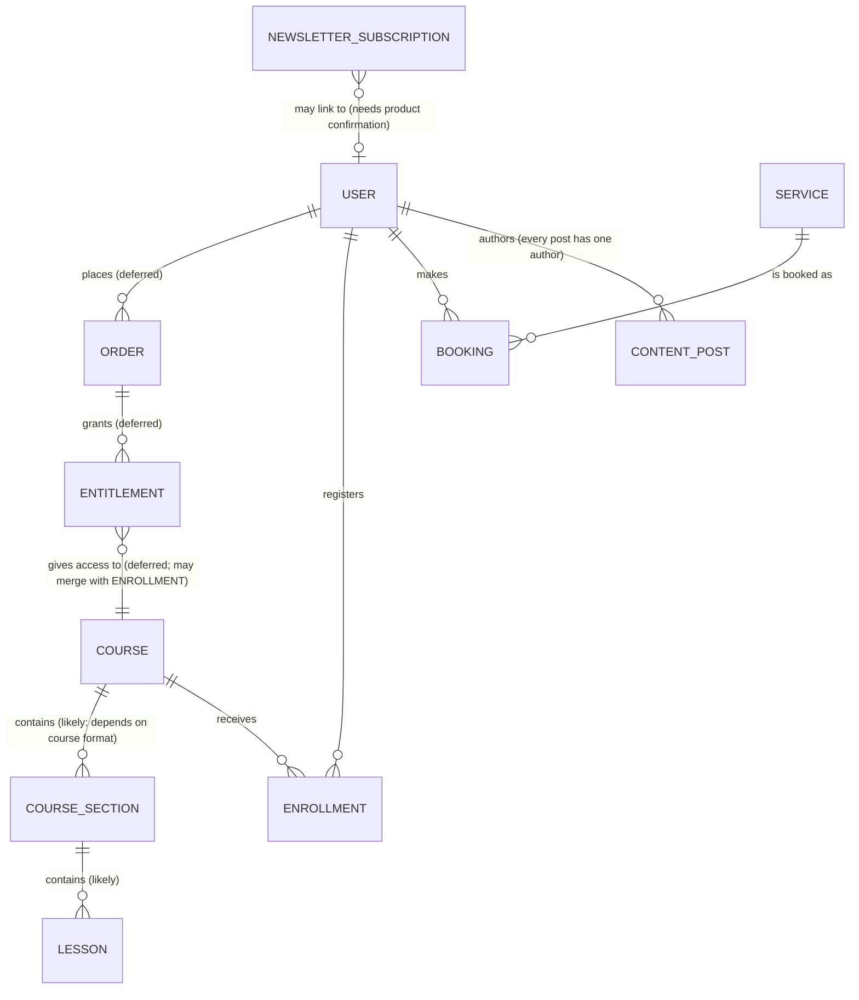

# Data Model (conceptual)

This document covers **what business data XuanCreative has** and **how the business concepts relate**.

| Need | Read |
|---|---|
| Business concepts, their meaning, status and relationships | **This document** |
| How we design PostgreSQL schemas (conventions, constraints, migrations) | `database.md` §1–§11 |
| The **actual, decided physical schema** (tables, columns, types, keys) | `database.md` §12, *Physical database map* |
| Where code lives | `architecture.md` |

**Conceptual means:**
- no columns and no types;
- a box here is a business concept, not necessarily a table;
- a concept becomes physical only when its slice designs it (then it appears in `database.md` §12).

**Three things this document never equates:**
- **Module ≠ table.** One module may own several tables (courses → courses, sections, lessons).
- **Role ≠ table.** "Admin" is a meaning a user can have. How that's stored is undecided (§4).
- **Concept ≠ decided schema.** Only `database.md` §12 is decided schema.

## 1. Status legend

| Status | Meaning |
|---|---|
| **CONFIRMED** | A real product capability the owner has stated. It will be built; its design happens in its slice |
| **LIKELY / NEEDS PRODUCT DESIGN** | Probably needed, or its shape depends on a product decision not yet made. Don't build or guess |
| **DEFERRED** | Not part of the product's current direction, or handled outside the system for now |

## 2. Domain map

**Reading the map:**
- `||--o{` means "one to many": a user authors many posts, and each post has exactly one author.
- `}o--o|` means "optional": a newsletter subscription may exist without an account.
- Labels carry the status when it isn't CONFIRMED.
- Authorization is not drawn as a box (§4).

## 3. Catalogue

| Concept | Business meaning | Status | Relates to | Owning module |
|---|---|---|---|---|
| **User / account** | A person who signs in, with reusable profile details so they don't re-enter them for every booking or registration | CONFIRMED | authors posts; makes bookings; registers in courses | Designed in the auth slice |
| **Role** (authorization concern) | What a user may do: customer, editor or admin. Xuân is an admin user; editors and customers are users too | CONFIRMED *as a concept*. **Persistence pending the auth slice** (§4) | qualifies a user | Auth slice |
| **Service** | An offer Xuân provides (e.g. a 1:1 session, a Kickstart session, coaching), as shown on Work With Me and the homepage "Ways" | CONFIRMED. **The first slice:** a public, read-only catalog | is booked as bookings | `services` (first slice) |
| **Booking** | A user's reservation of a service | CONFIRMED as a capability. **The exact booking workflow** (calendar, request/approve, payment) **needs product design** | user; service | — |
| **Course** | A structured learning product a user can register for | CONFIRMED | receives enrollments; contains sections (likely) | — |
| **Course section / lesson** | The ordered parts of a course a learner works through | LIKELY: depends on the course format (self-paced vs live/cohort) | course | — |
| **Enrollment** | A user's registration in a course | CONFIRMED | user; course | — |
| **Content post** | An article/post published on the site. **Every post has an author user** | CONFIRMED as a future capability. Content types, rich-text representation, media, draft/publish state and publishing workflow are **designed in the content slice** | author user | — |
| **Newsletter subscription** ("Creator Notes") | An email-only list membership that may exist without an account | **NEEDS PRODUCT CONFIRMATION**: design intent only. If confirmed, it's introduced explicitly as a newsletter/email-subscription capability, never as a generic "subscribers" | optionally a user | — |
| **Building project** ("Đang xây") | Something Xuân is building, with a status | NEEDS PRODUCT DESIGN, and only if it ever becomes database-managed (it's static copy today) | — | — |
| **Order** | A record of a purchase | DEFERRED | user; entitlements | — |
| **Payment** | Money movement for an order | DEFERRED | order | — |
| **Entitlement** | A user's right to access paid content | DEFERRED until its relationship with enrollment is designed (they may turn out to be one concept) | order; course | — |
| **Inquiry** | A message sent through a contact form | DEFERRED while collaboration enquiries stay `mailto` | — | — |
| **External providers** | Email, payment, calendar or newsletter services we integrate with | DEFERRED | — | — |
| **Support / donation** ("Arabica") | Supporting Xuân | DEFERRED while it's handled externally | — | — |

## 4. Authorization (conceptual requirements)

**Confirmed:** there is one user/account identity, and a user can carry an authorization meaning of **customer**, **editor** or **admin**.

**Not decided, pending the auth slice:**
- whether a user has one role or several;
- whether a role is a column on users, or `roles`/`user_roles` tables exist;
- whether a richer permission system is ever justified.

Nothing here implies any of those storage choices.

### Two different authorization questions

| Kind | Question | Needs the specific record? |
|---|---|---|
| **Role-based** | "What category of user is this, and may that category do this action at all?" | No |
| **Resource ownership** | "Does *this* content record belong to *this* editor?" | Yes: load the record and compare its author with the current user |

Content therefore conceptually has an **author user**. The Nest mechanism (guards, policies, decorators) is designed in the auth and content slices, not here.

### Content permissions

| Action | Admin | Editor | Customer |
|---|---|---|---|
| Create a post | ✓ | ✓ (becomes its author) | ✗ |
| Edit own post | ✓ | ✓ | ✗ |
| Edit another user's post | ✓ | ✗ | ✗ |
| Delete a post | ✓ | ✗ | ✗ |
| **Publish** | ✓ | **OPEN product decision**: publish directly, or drafts for admin approval | ✗ |
| Manage users / system administration | ✓ | ✗ | ✗ |

## 5. Open product decisions affecting the model

- **Which offers exist.** The homepage design (*Kickstart 90 min*, *3-Month Coaching*) and the live Work With Me page (*1:1 cùng Xuân, 60 min*) disagree. The Services catalog stores whichever the owner chooses as data.
- **Booking workflow:** scheduling, confirmation, payment.
- **Course format:** decides sections/lessons.
- **Content publishing workflow,** and whether editors may publish.
- **Newsletter (Creator Notes):** real capability or not.
- **Enrollment vs entitlement:** one concept or two (decided with orders).
- **Money:** currency, price units, formatting. That's why services carry **no price** in V1.
