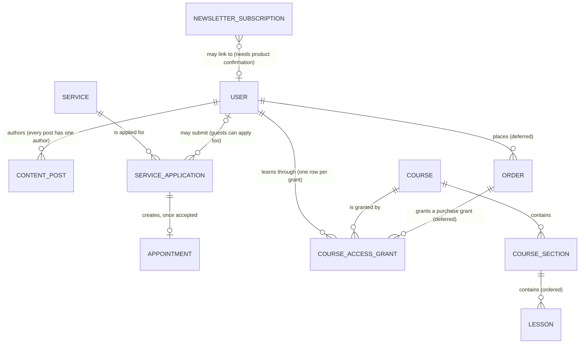

# Data Model (conceptual)

This document covers **what business data XuanCreative has** and **how the business concepts relate**.

| Need | Read |
|---|---|
| Business concepts, their meaning, status and relationships | **This document** |
| How we design PostgreSQL schemas (conventions, constraints, migrations) | `database.md` §1–§11 |
| The **actual, decided physical schema** (tables, columns, types, keys) | `database.md` §12, *Physical database map* |
| Where code lives | `architecture.md` |

**Conceptual means:**
- no columns and no types;
- a box here is a business concept, not necessarily a table;
- a concept becomes physical only when its slice designs it (then it appears in `database.md` §12).

**Three things this document never equates:**
- **Module ≠ table.** One module may own several tables (courses → courses, sections, lessons).
- **Role ≠ table.** "Admin" is a meaning a user can have. How that's stored is undecided (§4).
- **Concept ≠ decided schema.** Only `database.md` §12 is decided schema.

## 1. Status legend

| Status | Meaning |
|---|---|
| **CONFIRMED** | A real product capability the owner has stated. It will be built; its design happens in its slice |
| **LIKELY / NEEDS PRODUCT DESIGN** | Probably needed, or its shape depends on a product decision not yet made. Don't build or guess |
| **DEFERRED** | Not part of the product's current direction, or handled outside the system for now |

## 2. Domain map


```mermaid
erDiagram
    USER ||--o{ CONTENT_POST : "authors (every post has one author)"
    SERVICE ||--o{ SERVICE_APPLICATION : "is applied for"
    USER |o--o{ SERVICE_APPLICATION : "may submit (guests can apply too)"
    SERVICE_APPLICATION ||--o| APPOINTMENT : "creates, once accepted"
    USER ||--o{ COURSE_ACCESS_GRANT : "learns through (one row per grant)"
    COURSE ||--o{ COURSE_ACCESS_GRANT : "is granted by"
    COURSE ||--o{ COURSE_SECTION : "contains"
    COURSE_SECTION ||--o{ LESSON : "contains (ordered)"
    USER ||--o{ ORDER : "places (deferred)"
    ORDER ||--o{ COURSE_ACCESS_GRANT : "grants a purchase grant (deferred)"
    NEWSLETTER_SUBSCRIPTION }o--o| USER : "may link to (needs product confirmation)"
```

**Reading the map:**
- `||--o{` means "one to many": a user authors many posts, and each post has exactly one author.
- `}o--o|` / `|o--o{` mean "optional": a newsletter subscription may exist without an account; an application may come from a guest.
- `||--o|` means "zero or one" (0..1): a pending or rejected application has no appointment; an accepted, scheduled application has exactly one. The physical constraint is deferred to the application/booking slice.
- Labels carry the status when it isn't CONFIRMED.
- Authorization is not drawn as a box (§4).

## 3. Catalogue

| Concept | Business meaning | Status | Relates to | Owning module |
|---|---|---|---|---|
| **User / account** | A person who signs in, with reusable profile details so they don't re-enter them for every application or registration | CONFIRMED | authors posts; may submit service applications; registers in courses | Designed in the auth slice |
| **Role** (authorization concern) | What a user may do: customer, editor or admin. Xuân is an admin user; editors and customers are users too | CONFIRMED *as a concept*. **Persistence pending the auth slice** (§4) | qualifies a user | Auth slice |
| **Service offering** | An offer Xuân provides publicly, as shown on Work With Me and the homepage "Ways". Current examples: *Channel Kickstart Session* (a 90-minute 1:1 session) and *3-Month 1:1 Coaching* (a 12-week program). **A catalog entry, not an appointment** (§3.1) | CONFIRMED. **The first slice:** a public, read-only catalog | is applied for through service applications | `services` (first slice) |
| **Service application** | A person asking to work with Xuân on a specific offering. Reviewed before Xuân accepts the client (§3.1) | CONFIRMED future concept. **Persistence DEFERRED** to the application/booking slice | service offering; optionally a user; zero or one appointment (0..1) | — |
| **Appointment** | An actual, scheduled meeting, created only from an accepted application (§3.1) | CONFIRMED future concept. **Persistence and calendar integration DEFERRED** to the application/booking slice | service application | — |
| **Course** | A structured learning product a user can register for | CONFIRMED | receives access grants; contains sections | Designed 2026-10-17 (course platform spec): `courses` module |
| **Lesson progress** | A learner's saved position and completion in one lesson, for resuming on any device. Self-reported learning state, never proof of viewing. One per (learner, lesson); completion is sticky; kept when access is revoked or the course or lesson is unpublished | CONFIRMED, designed 2026-10-19 (course outcome 3, course spec §9) | user (learner); lesson | `courses` (table `lesson_progress`) |
| **Course section / lesson** | The ordered parts of a course a learner works through: sections contain ordered lessons, and a lesson points to a Vimeo video | CONFIRMED | course | Designed 2026-10-17 (course platform spec): `courses` module |
| **Course access grant** (resolves *enrollment* and *entitlement*) | One right to learn one course, given by an admin now (and by a verified purchase later). **One row per grant**: a user has access while at least one of their grants for that course is active; a revocation closes its grant and keeps it as history, and restoring access adds a new grant. "Enrolled" is derived (has an active grant), not a separate record | CONFIRMED, designed 2026-10-19 (course outcome 2, course spec §5, OD-1) | user (learner, granter, revoker); course; later an order | `courses` (table `course_access_grants`) |
| **Content category** | A named group of blog posts (BD-3): a stable key plus a Vietnamese slug and label (English adds rows later). One category per post; admins manage them; a used category is archived, never deleted | CONFIRMED 2026-10-19 (blog completion B2) | posts | `content` (tables `content_categories`, `content_category_translations`) |
| **Content post** | An article/post published on the site. **Every post has an author user** | CONFIRMED. **V1 designed 2026-10-15** (blog design spec): text-first blog posts in Vietnamese (i18n-ready), a TipTap/ProseMirror JSON body (H2/H3, lists, quotes, bold, italic, links; no images yet), draft/published, SEO title/description; slug locked after first publication; publishing needs real content. **Blog completion (owner decisions BD-1…BD-13, 2026-10-19; spec `2026-10-19-blog-completion-design.md`):** B1 adds the `archived` state (restore → draft), hard delete only for never-published drafts, and up to 10 tags per post; categories, media and discussion follow in B2–B4. Scheduling, redirects and previews stay deferred (§5) | author user | `content` (table `content_posts`) |
| **Newsletter subscription** ("Creator Notes") | An email-only list membership that may exist without an account | **NEEDS PRODUCT CONFIRMATION**: design intent only. If confirmed, it's introduced explicitly as a newsletter/email-subscription capability, never as a generic "subscribers" | optionally a user | — |
| **Building project** ("Đang xây") | Something Xuân is building, with a status | NEEDS PRODUCT DESIGN, and only if it ever becomes database-managed (it's static copy today) | — | — |
| **Order** | A record of a purchase | DEFERRED | user; course access grants (purchase source) | — |
| **Payment** | Money movement for an order | DEFERRED | order | — |
| **Inquiry** | A message sent through a contact form | DEFERRED while collaboration enquiries stay `mailto` | — | — |
| **External providers** | Email, payment, calendar or newsletter services we integrate with | Google Calendar / Meet and applicant email notifications: CONFIRMED future integrations of the application/booking slice (§3.1). The others: DEFERRED | appointments; applications | — |
| **Support / donation** ("Arabica") | Supporting Xuân | DEFERRED while it's handled externally | — | — |

### 3.1 Service offerings, applications and appointments

Working with Xuân is **application-based**. Nobody buys or books an offer directly: Xuân reviews each person first and may turn them down. For example, someone whose goal is mainly faceless-channel monetization or AI-generated video isn't a fit for Xuân's *Personal Brand through Content* work.

```
ServiceOffering ──► ServiceApplication ──(accepted)──► Appointment / calendar event
  what Xuân offers    someone asks to work with Xuân      an actual scheduled meeting
```

| Concept | Is | Isn't |
|---|---|---|
| **Service offering** | What Xuân offers publicly (the catalog) | A bookable time slot or a session with a fixed length |
| **Service application** | One person's request to work with Xuân on one offering, with a requested slot | An accepted client or a confirmed meeting |
| **Appointment** | A real meeting on Xuân's calendar, created after acceptance | The whole engagement (for 3-Month 1:1 Coaching, it's the **first** meeting only) |

**Conceptual flow:**

1. A visitor opens a service page and clicks apply / book.
2. They fill in an application: full name, phone, email, Facebook URL (optional), the Personal Brand or channel they're building, what they want Xuân's help with, and a requested available slot. Later, slots may come from Xuân's Google Calendar availability.
3. The application is **pending**. Xuân reviews it in the admin area.
4. **Rejected:** the status becomes rejected, with an optional rejection reason, and the applicant is notified by email.
5. **Accepted:** the status becomes accepted, and the selected time is reserved.
   - A Google Calendar event is created for Xuân. It's traceable back to the application or person through a stable reference, e.g. the internal application id.
   - A Google Meet link is created.
   - The applicant receives the invitation by email and can accept the Google Calendar invitation.

**Confirmed requirements** (for the application/booking slice to design):
- Users submit an application first; they never automatically purchase or book an offer.
- Xuân accepts or rejects each application; a rejection may carry an optional reason.
- Statuses include at least *pending*, *accepted* and *rejected*.
- Guests can apply. Logged-in users may later get their details prefilled.
- An accepted application creates/synchronizes a Google Calendar event with a Google Meet link and an attendee invitation.
- For **3-Month 1:1 Coaching**, the application schedules the first meeting / qualification conversation only. The 12-week delivery isn't modeled as one long appointment; ongoing work may happen through social channels and other tools.

**Deferred to that slice:** tables, columns, statuses as stored, the Google Calendar / Meet integration design, and email delivery.

**Design trigger (not solved here):** two applicants may see and request the same free slot. The slice must define how pending applications affect slot availability (e.g. temporary holds), so Xuân can never accept two people into the same slot.

## 4. Authorization (conceptual requirements)

**Confirmed and implemented (2026-10-14, auth slice; `architecture.md` §17):**
- One account per person (`users`), signing in with **Google only** in V1. Provider identities are separate rows (`auth_identities`: provider + provider user id), so Facebook can be added later without changing `users`.
- **One role per user**, a `role` column: `user` (the customer), `editor` or `admin`. New accounts are `user`. No roles/permissions tables.
- The local account is the source of truth for role and profile after sign-in; Google only bootstraps and syncs email, name and avatar.
- Initial admins come from the `AUTH_ADMIN_EMAILS` allowlist (verified Google email). Admins move people between `user` and `editor`; removing an editor never deletes the account; no API grants or removes `admin`.

**Future references to a user:** a content post's author, a service application's applicant (optional: guests apply too; the application keeps a snapshot of the submitted name/email for history, and the profile is used to prefill the form), appointments through their application, orders/payments, enrollments and course access.

### Two different authorization questions

| Kind | Question | Needs the specific record? |
|---|---|---|
| **Role-based** | "What category of user is this, and may that category do this action at all?" | No |
| **Resource ownership** | "Does *this* content record belong to *this* editor?" | Yes: load the record and compare its author with the current user |

Content therefore conceptually has an **author user**. The Nest mechanism (guards, policies, decorators) is designed in the auth and content slices, not here.

### Content permissions

| Action | Admin | Editor | User (customer) |
|---|---|---|---|
| Create a post | ✓ | ✓ (becomes its author) | ✗ |
| Edit own post | ✓ | ✓ | ✗ |
| Edit another user's post | ✓ | ✗ | ✗ |
| Publish / unpublish **own** post | ✓ | ✓ | ✗ |
| Delete **own** post | ✓ | ✓ | ✗ |
| Publish / unpublish / delete **another author's** post | ✓ | ✗ | ✗ |
| Manage editors (user ↔ editor) / system administration | ✓ | ✗ | ✗ |

## 5. Open product decisions affecting the model

- **Final catalog content:** *settled 2026-10-14.* The seed (`src/modules/services/services.seed.ts`) holds the owner-approved slugs, titles and summaries for *Channel Kickstart Session* (`channel-kickstart`) and *3-Month 1:1 Coaching* (`3-month-1-1-coaching`). Still open: whether the UI needs structured display metadata (e.g. "90 minutes", "12 weeks") instead of copy in the summary.
- **Application/booking details** (§3.1): the final form fields, where available slots come from and how they're held, email content, and whether and when payment is involved.
- **Course format:** *settled 2026-10-17.* Self-paced video: a course holds ordered sections, each holding ordered lessons that point to Vimeo videos (course platform spec §4).
- **Content publishing workflow** beyond the settled rule (editors publish and delete their own posts; admins any). V1 settled 2026-10-15: draft/published, `publishedAt` = first publication, slug locked after it, publishing needs real content (blog design spec B16–B19). **Settled 2026-10-19 (blog completion, BD-1…BD-13):** archive (restore → draft), deletion (hard delete only for never-published drafts; anything ever published is archived), tags, categories, media storage and cover/OG, body version 2, ratings and comments with admin moderation, slugs stay locked (no redirects). **Still open:** scheduled publishing, draft preview links, search, featured/reading time, multilingual UI and translation groups (BD-9 deferred).
- **Newsletter (Creator Notes):** real capability or not.
- **Enrollment vs entitlement:** *settled 2026-10-19.* One concept, the course access grant, one row per grant (course spec §5, OD-1).
- **Money:** currency, price units, formatting. That's why services carry **no price** in V1.
