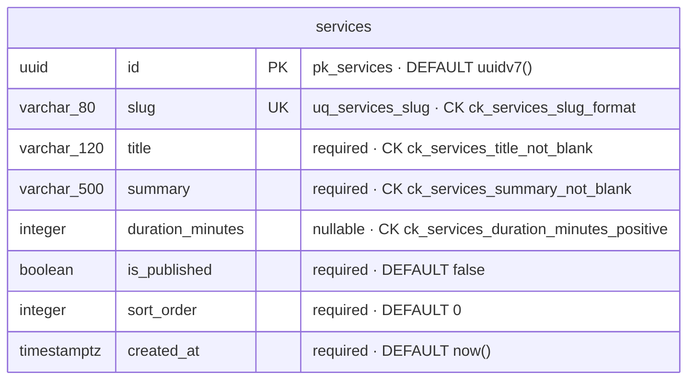

# Database

This document covers **what** our PostgreSQL / TypeORM / migration practice is and **why**.
- Rule wording and classes: `code-rules.md` (cited here by ID).
- Where persistence sits in the app: `architecture.md` §6, §9.
- Which business concepts exist and how they relate: `data-model.md`. **The actual, decided schema:** §12 of this document.
- The order of work for a schema change: the `xuan-database-change` skill.

## 1. Principles

1. **The database is an authority, not a storage bin.** A rule that must always hold ("one row per slug") is enforced by a constraint, so no code path, script or future bug can break it (D31). Application checks are for good error messages; constraints are for truth.
2. **SQL is visible.** We use an ORM, but we read the SQL it generates, both for migrations and for non-trivial queries (D33, D38).
3. **Schema history is code.** Every change is a reviewed, committed migration (I7).
4. **Learn Postgres directly, not only through TypeORM** (§11).

## 2. Naming

| Object | Convention | Example |
|---|---|---|
| Table | snake_case, plural | `services`, `course_lessons` |
| Column | snake_case | `created_at` |
| Entity property | camelCase | `createdAt` |
| Primary key | `pk_<table>` | `pk_services` |
| Unique | `uq_<table>_<cols>` | `uq_services_slug` |
| Foreign key | `fk_<table>_<col>` | `fk_course_lessons_course_id` |
| Index | `ix_<table>_<cols>` | `ix_courses_published_at` |
| Check | `ck_<table>_<rule>` | `ck_services_slug_lowercase` |

**Explicit names** are declared in the entity (`@Entity('services')`, `@Column({ name: 'created_at' })`), with **no custom `NamingStrategy`** (D24). You see every name where it's declared, without first learning a hidden class.

**Constraint names are always explicit** (D25), because:
1. Module code references them by name when translating errors (§9).
2. They show up readably in logs and `\d+`.
3. TypeORM's defaults are hashes (`UQ_8f3e…`) that change unpredictably.

## 3. Primary keys

**Default:** `id uuid PRIMARY KEY DEFAULT uuidv7()` (D26). A different strategy needs a concrete reason (C8).

| Why | |
|---|---|
| Generated by the database | The database stays the authority. `uuidv7()` is native in PostgreSQL 18, so no extension is needed |
| UUID | Matches xuan-web's `id: string`. Not guessable or countable the way `1, 2, 3` is |
| v7, not v4 | Time-ordered, so B-tree inserts stay local and the index stays compact |
| Accepted cost | A v7 id reveals its creation time to the millisecond |

A malformed UUID in a path is a validation error, not a 404 (D9).

## 4. Timestamps

- Business records get `created_at timestamptz NOT NULL DEFAULT now()` (D27).
- `updated_at` is added **only when the record changes during its lifecycle** (via `@UpdateDateColumn`). Immutable or insert-only tables don't carry a column that never moves. When the first update path arrives, `updated_at` comes with it in its own migration.
- Real instants are **`timestamptz`** (D28). It stores an absolute moment. `timestamp` without a time zone stores a wall-clock reading that means different things on different servers, which is a classic bug.
- On the wire, instants are ISO 8601 UTC strings.

## 5. Strings and canonical identifiers

- `varchar(n)` where a real maximum exists, `text` otherwise (D29). A limit that matters lives in the database too, not only in Zod.
- **Case-insensitive identifiers** (D30): when a business identifier is *intentionally* case-insensitive (a URL slug, later a login email), we choose one canonical stored form and the database enforces it. We don't lowercase identifiers in general.

| Option considered | Verdict |
|---|---|
| `citext` | An extension type; the PostgreSQL docs now steer toward collations |
| Non-deterministic ICU collation | Correct but advanced |
| `UNIQUE (lower(<col>))` expression index | Every query must remember `lower()`, and TypeORM handles expression indexes poorly |
| **Normalize + enforce** | **Chosen:** the app writes the canonical form (e.g. lowercase); `CHECK (<col> = lower(<col>))` + `UNIQUE (<col>)` make any other stored form impossible |

## 6. Constraints as authority

| Invariant | Constraint |
|---|---|
| Uniqueness | `UNIQUE` |
| Reference exists | `FOREIGN KEY` |
| Value required | `NOT NULL` |
| Value allowed | `CHECK` |

**Why both app checks and constraints:** Zod produces a good field error, and the constraint guarantees the truth under concurrency, scripts and bugs. Two concurrent "find, then insert" requests both see "not found"; only a constraint stops the duplicate. That's the classic race from the old backend.

### Expected conflicts as normal results

When a conflict is an *expected* outcome and SQL expresses it clearly, it's handled as a result rather than an exception (C6):

```sql
-- generic illustration, not a decided table
INSERT INTO <table> (<cols>) VALUES (...)
ON CONFLICT ON CONSTRAINT uq_<table>_<cols>
DO NOTHING
```

**The conflict target is always named** (D32). A target-less `ON CONFLICT DO NOTHING` silently absorbs *any* unique violation, including one from a constraint added years later for a different reason.

TypeORM's `.orIgnore()` produces the target-less form, so an insert that uses `ON CONFLICT` must name its target by another mechanism. The exact TypeORM mechanism is a verification spike (`architecture.md` §16).

## 7. Migrations

**Lifecycle** (D33, I7):

```
change entity ─► migration:generate ─► READ the SQL ─► fix names/defaults if needed ─► migration:run
      ─► inspect in psql (\d+ table) ─► migration:revert ─► migration:run again   (reversible changes, while learning)
```

| Practice | Why |
|---|---|
| Run by **explicit command only** (locally, test setup, deploy). Never `synchronize`, never `migrationsRun` at boot (I7) | `synchronize` diffs and alters live tables silently, and can drop data. Boot-time migration surprises production |
| **Read the generated SQL** before running it (D33) | Generated is not reviewed. The SQL is what actually happens |
| **One logical change per migration** (D33) | It can be reviewed, reverted and understood alone |
| **Never rewrite** a migration merged or applied anywhere; write a new one (D33) | Other databases already ran the old version. Rewriting it forks history |
| **Meaningful `down()`** when safely reversible (D34) | It enables revert practice and local recovery |
| **Irreversible changes** (C9): no fake `down()`; document recovery or roll-forward | A misleading rollback is worse than none |
| **Generate twice:** the second generate must be empty | Proves the entities and the database agree (no phantom diff) |
| Location `src/database/migrations/` (D35); schema `public`; no extensions in V1 | — |

**Expand → migrate → contract** (C10), when a change would break existing data or running code:
1. **Expand:** add the new column or table, nullable or with a default; deploy code that writes both.
2. **Migrate:** backfill.
3. **Contract:** add `NOT NULL`, drop the old one, once nothing reads it.

Renames, type changes, `NOT NULL` on populated tables and drops are the usual cases.

The CLI's `DataSource` (in `database/`) gets its connection from the same `loadConfig()` as the app (D18). Running it under the ESM starter is a verification spike.

## 8. Transactions

- A transaction is needed **when several writes must succeed or fail together** (C3). A single statement is already atomic.
- **Inside a transaction, use only the transaction's manager** (I8):

```
dataSource.transaction(async (manager) => {
  const orders = manager.getRepository(Order);          ✓ participates
  await this.ordersRepository.insert(...);              ✗ runs OUTSIDE the transaction, on another connection
});
```

**Why:**
- The injected repository uses the connection pool, not the transaction's connection.
- Its writes commit independently, and they survive a rollback.
- This is the most common TypeORM transaction bug, and nothing warns you about it.

## 9. Database errors

**This section owns the facts.** `database/` helpers answer factual questions about a database error; they never assign business meaning (D11, `architecture.md` §9).

| SQLSTATE | Meaning | Typical constraint |
|---|---|---|
| `23505` | unique violation | `uq_…` |
| `23503` | foreign key violation | `fk_…` |
| `23502` | not-null violation | column |
| `23514` | check violation | `ck_…` |

**Who knows what:**

| Layer | Knows |
|---|---|
| `database/` helper | "Is this a unique violation on `uq_courses_slug`?" |
| Owning service | "…then the slug is taken" → `AppError` |
| HTTP filter | Only `AppError` (I15) |

An untranslated violation is a bug: 500 + log, never a generic 409 (I15).

**Each translated constraint gets an e2e test** on real Postgres. It proves the constraint name in the code matches the name in the database.

## 10. TypeORM guardrails

| Guardrail | Rule | Why |
|---|---|---|
| Never pass request input wholesale to persistence | I9 | Mass assignment: one extra field (`role`, `isAdmin`) writes a column nobody meant to expose |
| Prefer explicit `insert`/`update`/QueryBuilder over `save()` | D36 | `save()` decides INSERT vs UPDATE for you, cascades, and encourages object-graph thinking. That's the Mongoose habit |
| No eager or lazy relations; load explicitly per query | D37 | Eager over-fetches everywhere; lazy hides N+1 queries behind property access |
| QueryBuilder/explicit queries where behavior deserves visibility; inspect the SQL | D38 | Know the joins and the query count before production does |
| Transactions use the manager | I8 | §8 |
| Entities never reach the wire | I10 | `architecture.md` §8 |

## 11. Local PostgreSQL and `psql` practice

**Environment:**
- Docker Compose `postgres:18` on host port **5433**. The native PostgreSQL 12 on 5432 is left untouched.
- Databases `xuan_dev` and `xuan_test`, owned by the login role `xuan_app`.
- The `postgres` superuser is for admin experiments only.
- Separate migration and runtime roles are deferred to deployment.
- Setup: `development-workflow.md` (Local setup).

**Docker is the local server environment, not a replacement for learning PostgreSQL.**

| Docker hides | Docker does not hide |
|---|---|
| Install/upgrade, the Windows service, the data directory, `postgresql.conf`/`pg_hba.conf` | SQL, `psql`, roles, privileges, databases, schemas, constraints, indexes, `EXPLAIN`, transactions, locks, connection strings, migrations |

**Daily practice:**

```
docker compose exec db psql -U xuan_app xuan_dev     # SQL console inside the container (its psql matches the server)
\dt                                                  # tables
\d+ services                                         # columns, defaults, constraints, indexes
SELECT * FROM migrations;                            # what TypeORM has applied
EXPLAIN SELECT … ;                                   # the plan, without executing
```

- **pgAdmin** (optional) connects to `localhost:5433` as `xuan_app`. It's useful for browsing; the console is where the learning happens.
- After every migration: `\d+` the table and check the names, types, defaults and constraints against what you intended.

## 12. Physical database map

The **actual, decided schema**, so the current database can be understood at a glance.

| | `data-model.md` | This section |
|---|---|---|
| Shows | Business concepts and their conceptual relationships, including future and undecided ones | Only tables that are **decided** (designed in a slice plan) or **implemented** (a migration exists) |
| Level | No columns, no types | Every column, its PostgreSQL type, keys, constraints, important indexes and defaults |

**Legend:**

| Mark | Meaning |
|---|---|
| **PK** | Primary key |
| **FK** | Foreign key (→ referenced table) |
| **UQ** | Unique constraint |
| **CK** | Check constraint |
| **IX** | Index |

`NOT NULL` is written as *required*. Defaults are shown as written in SQL (`uuidv7()`, `now()`).

**Maintenance:**
- The map changes **in the same change as the migration** that alters the schema.
- Checking it is part of every schema-change review (`development-workflow.md` §8 and the Definition of Done).
- A table appears here once its slice plan settles its columns, marked *decided*. It becomes *implemented* when its migration runs.
- Nothing is added speculatively for future domains.

### Current schema

| Table | Status | Owning module | Settled in |
|---|---|---|---|
| `services` | **decided** (awaiting owner review; no migration yet) | `services` (entity `ServiceOffering`) | `docs/superpowers/plans/2026-10-09-foundation-and-services-catalog.md`, Task 13 |

#### `services`

One row per offer Xuân provides, shown on Work With Me and the homepage "Ways". **No price in V1** (money is an open product question).



| Column | Type | Required | Default | Keys / constraints | Why |
|---|---|---|---|---|---|
| `id` | `uuid` | yes | `uuidv7()` | **PK** `pk_services` | Identity generated by the database (D26) |
| `slug` | `varchar(80)` | yes | — | **UQ** `uq_services_slug`; **CK** `ck_services_slug_format` | The URL key in `/services/:slug`. Unique, so a URL names one service. The format check is the canonical form (D30) |
| `title` | `varchar(120)` | yes | — | **CK** `ck_services_title_not_blank` | The offer's name. `NOT NULL` alone would still allow `''` or `'   '` |
| `summary` | `varchar(500)` | yes | — | **CK** `ck_services_summary_not_blank` | The card/detail description |
| `duration_minutes` | `integer` | **no** | — | **CK** `ck_services_duration_minutes_positive` | Length of one session (e.g. 60, 90). **NULL** when the offer isn't a single fixed-length session (e.g. a 3-month coaching program, whose length lives in its title) |
| `is_published` | `boolean` | yes | `false` | — | Only published services are visible through the public API. Unpublished = draft |
| `sort_order` | `integer` | yes | `0` | — | Display order in the catalog (ties broken by `slug`) |
| `created_at` | `timestamptz` | yes | `now()` | — | When the row was created (D27). **No `updated_at`:** the table has no update path in V1 (seed and admin come later) |

**Table-level constraints and indexes:**

| Name | Kind | Definition | Note |
|---|---|---|---|
| `pk_services` | PRIMARY KEY | `(id)` | Postgres creates its index automatically |
| `uq_services_slug` | UNIQUE | `(slug)` | Also the index that serves `GET /services/:slug`. The seed's `ON CONFLICT` target (D32) |
| `ck_services_slug_format` | CHECK | `slug ~ '^[a-z0-9]+(-[a-z0-9]+)*$'` | Lowercase kebab-case only: `kickstart-session` ✓, `Kickstart` ✗, `a--b` ✗, `-x` ✗. Makes "lowercase" impossible to violate |
| `ck_services_title_not_blank` | CHECK | `btrim(title) <> ''` | Rejects empty and whitespace-only titles |
| `ck_services_summary_not_blank` | CHECK | `btrim(summary) <> ''` | Same for the summary |
| `ck_services_duration_minutes_positive` | CHECK | `duration_minutes > 0` | A CHECK passes when the expression is NULL, so NULL stays allowed while `0` and negatives are rejected |
| *(no other index)* | — | — | The catalog is a handful of rows: `WHERE is_published ORDER BY sort_order` is a sequential scan, which is the fastest plan at this size. Add `ix_services_…` only when `EXPLAIN` on real data says so |
